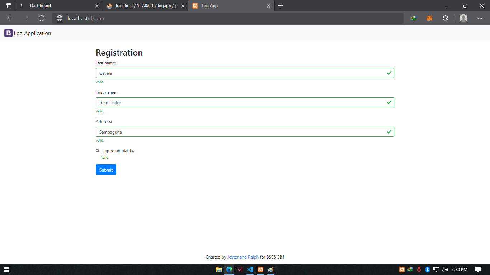
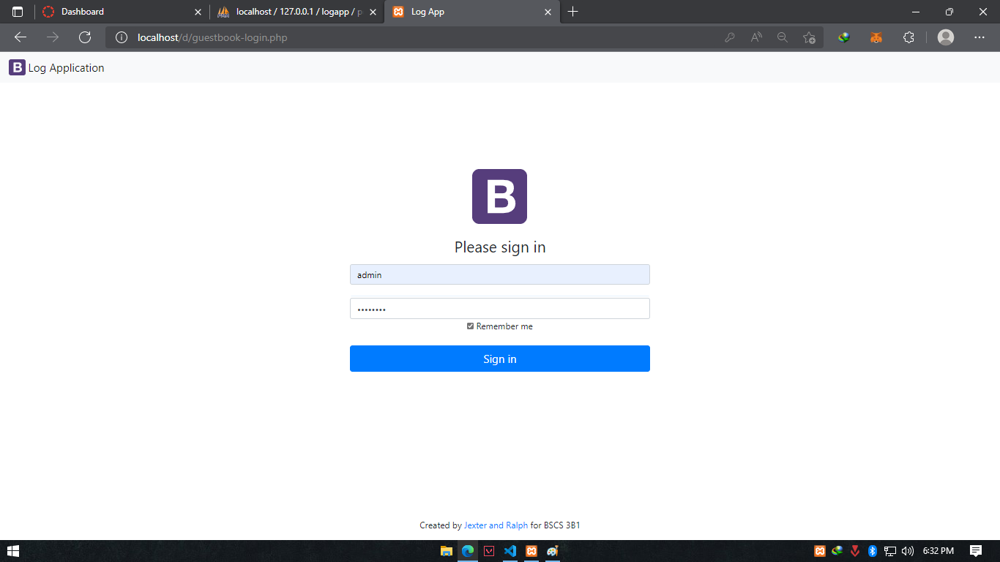
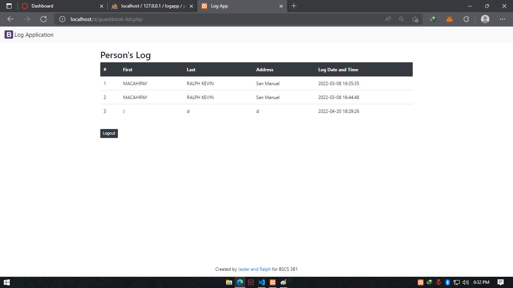
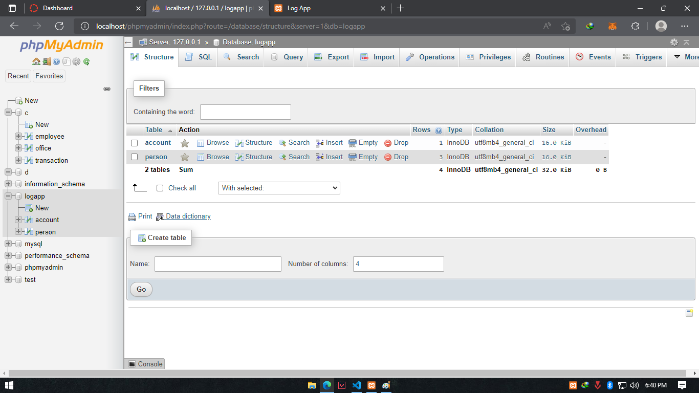

# LOG APP

## Description
Log  App is a application that allows the user  
to gather data for Covid Tracking Purposes within  
the establishement. 

### The Log App is consist of 3 Pages:

[Registaration](index.php "Index.php")- Registration Page 
  
***
[Admin](index.php "Index.php")- Admin Page  
 
***
[Viewing](index.php "Index.php")- Viewing Page
 

## Built With
* [Bootstrap](https://getbootstrap.com/)
* [php](https://www.php.net/)
* [xampp](https://www.apachefriends.org/index.html)
# Setup
## Database
The Web Application used [xampp](https://www.apachefriends.org/index.html) for hosting the Web Application  
Locally while [freesqldatabase.com](https://www.freesqldatabase.com/) was used for hosting online web database powered by mysqldatabase.
## Database Setup Online and Offline Hosting
### Xampp(phpMyAdmin)

### FreeSQLdatabase

# Authors

__Ralph Kevin Machipay__  and __John Lexter Gevela__

